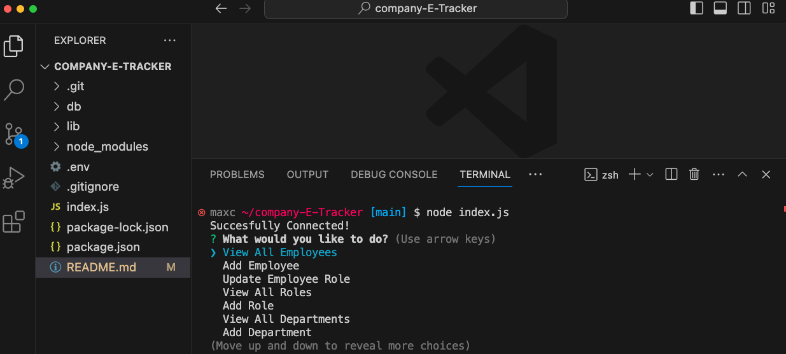

# Company-E-Tracker

The Company E Tracker is a user-friendly tool designed to efficiently manage employee databases. This application helps businesses keep workforce information organized and easily accessible.

# Description

    The motivation behind building this project was to create an employee database.

    The project was built to gain experience in interacting between a MySQL database and Node.js.

    This project addresses the problem of processing front-end requests into SQL queries and handling the responses.

    Throughout the building process, I learned how to effectively use Inquirer for input and integrate SQL queries with JavaScript.

# Installation

1. Clone Repo

2. npm i inquierer, mysql, console.table

3. Source schema.sql and seeds.sql

# Technology Used

- node.js, mysql, npm package (installs)
- JavaScript

# Usage

Open comand line terminal to index.js file, type node index.js on command line, enter, and then follow prompts

# Screenshots

# Links

Repo: https://github.com/Maxxxc1/company-E-Tracker

Video: 

# Credits/Questions

Max C.

Personal Tutor

# License

MIT License
